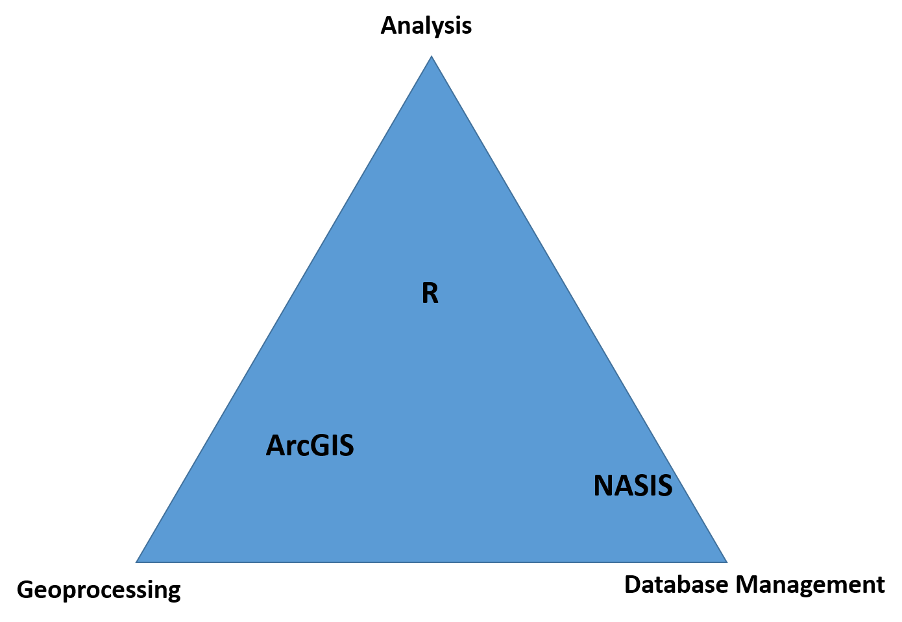
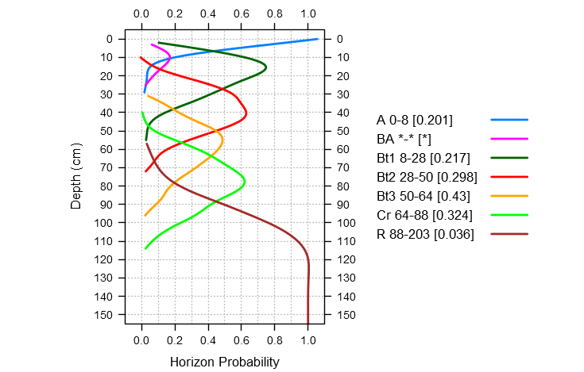

<!-- 
ideas:
http://landeco2point0.wordpress.com/2013/11/07/r-studio-and-presentations-and-git-oh-my/
http://rstudio-pubs-static.s3.amazonaws.com/27777_55697c3a476640caa0ad2099fe914ae5.html
https://r-forge.r-project.org/scm/viewvc.php/*checkout*/docs/aqp/gen-hz-assignment.html?root=aqp
-->

`{r setup, echo=FALSE, results='hide'} opts_chunk$set(message=FALSE, warning=FALSE, dpi=120, fig.align='center', dev='CairoPNG', dev.args=list(pointsize=10), tidy=FALSE, tidy.opts=list(width.cutoff=100), cache=TRUE) library(knitr) options(stringsAsFactors=FALSE)`

Soil Data Aggregation using R
=============================

transition: none width: 1024 height: 800 css: custom.css

          This document is based on:
<ul style="color: white; font-size:75%;">
<li>
`aqp` version `r utils::packageDescription("aqp", field="Version")`
</li>
<li>
`soilDB` version `r utils::packageDescription("soilDB", field="Version")`
</li>
<li>
`sharpshootR` version `r utils::packageDescription("sharpshootR", field="Version")`
</li>
</ul>

What is R?
==========

-   an analysis platform: calculator, statistics program, GIS, etc...
-   R syntax: vocabulary to explore, summarize, and model data 

What is R?
==========

-   an integrator: analysis + GIS + database connectivity
-   ODBC and GDAL link R to nearly all possible formats/interfaces 

What can R do?
==============

-   Base R (*functionality is extended through packages*)
-   basic summaries of quantitative or qualitative data
-   data exploration via graphics
-   GIS data processing and analysis

-   Integrated Workflow (*self-documenting, repeatable*)
-   report writing: code + summaries in a single document
-   digital soil mapping: modeling properties and classes
-   evaluation of OSD, KSSL, NASIS, ... for SDJR or related

-   Soil Science Specific Packages
-   visualization, aggregation, classification → [aqp package](http://aqp.r-forge.r-project.org/aqp-html-manual/index.html)
-   access to commonly used soil databases → [soilDB package](http://aqp.r-forge.r-project.org/soilDB-html-manual/index.html)
-   misc. soil survey specific functions → [sharpshootR package](http://aqp.r-forge.r-project.org/shapshootR-html-manual/index.html)

What can R do?
==============

      

**estimate a most-likely horizonation, details to follow**

What can R do?
==============

      

**estimate reasonable RIC, details to follow**

Setup your local machine
========================

-   Be sure to follow embedded links to full documentation
-   Check out the [AQP project website](http://aqp.r-forge.r-project.org/)
-   Browse some of the [various documentation](http://cran.r-project.org/manuals.html) on R

-   The first time you open RStudio, **install** required packages: `{r install-packages, tidy=FALSE, eval=FALSE} install.packages('aqp', dep=TRUE)  install.packages("RODBC", dep=TRUE) install.packages('soilDB', dep=TRUE)`

-   Every subsequent time, **load** required packages: `{r make-repeatable} library(aqp) library(soilDB) library(latticeExtra) # ... other libraries you might be using`

Connect to NASIS via ODBC
=========================

-   connection allows R to pull data from a NASIS *selected set* via the soilDB package
-   connection sets up a small file that stores the NASIS login and password
-   this is a one-time operation → [ODBC setup instructions](https://r-forge.r-project.org/scm/viewvc.php/*checkout*/docs/soilDB/setup_local_nasis.html?root=aqp)

-   getting data from NASIS is as simple as: \`\`\`{r use-nasis-data, eval=FALSE} \# get pedons from the selected set pedons \<- fetchNASIS()

plot the first 15
=================

plot(pedons[1:15, ])

get component data from the selected set
========================================

components \<- get\_component\_data\_from\_NASIS\_db() \`\``- be sure to read the documentation &#8594;&nbsp;[`fetchNASIS()\`](<https://r-forge.r-project.org/scm/viewvc.php/*checkout*/docs/soilDB/soilDB-Intro.html?root=aqp>)

Aggregation of Pedon Data: Common Problems
==========================================

-   description styles
-   the age-old splitters vs. lumpers
-   use of transitional horizons - I say tomato, you say tomato!

-   legacy horizon nomenclature
-   old school meets new school and they ain't speakin' the same language.....

-   soils described to varying depths - it's the pits!

Generalized Horizon Labels: Micro-correlation
=============================================

-   generalized horizon labels = GHL
-   determine the core concept
-   which way do transition horizons go?
-   GHL process allows for flexibility
-   horizon redundancy - how many Bt horizons are necessary?
-   outlier horizons - what happens to them?

Summary of GHL workflow
=======================

**Most of these steps are implemented in the reports presented last**

1.  Select a set of GHL that best represents a group of pedons to be aggregated.

2.  Assign GHL to each horizon using whatever information is available for grouping horizons.

3.  Evaluate GHL assignments and manually refine as needed.

4.  Keep track of final GHL assignments in NASIS or text file.

5.  Estimate a most likely horizonation e.g., top and bottom depths for each generalized horizon label.

6.  Compute range in characteristics, aka low-rv-high values, for clay, sand, pH, etc. over GHL. (next document in this series)

[→ extended tutorial](https://r-forge.r-project.org/scm/viewvc.php/*checkout*/docs/aqp/gen-hz-assignment.html?root=aqp)

Assumptions
===========

-   a collection of pedons for a component should represent an aggregated component
-   a GHL process of some kind is required to efficiently summarize and aggregate horizon data from these collections
-   low-rv-high values must be tied to some metric:
-   5th-50th-95th percentile is one option
-   linked pedons represent examples of the aggregate data, but aggregate data should not be limited to a very small set of linked pedons

-   **IMPORTANT** these reports and data summaries are a useful *starting point* for the aggregation process

Summarizing Data with Quantiles (Percentiles)
=============================================

-   suggested basis for RIC:
-   5th, 50th, and 95th percentiles are low-rv-high values
-   no assumptions of distribution, simple interpretation

\`\`\`{r quantiles-normal-dist, fig.width=11, fig.height=6, echo=FALSE} \# simulate 500 values from the normal distribution: with mean = 10, sd= 2 set.seed(1010101) x \<- rnorm(n=500, mean = 10, sd=2)

compute the 5th, 25th, 50th, 75th, and 95th percentiles of x
============================================================

q \<- c(quantile(x, probs=c(0.05, 0.25, 0.5, 0.75, 0.95)))

plot a smoothed frequency distribution
======================================

plot(density(x), main=list('Normal Distibution', cex=2), ylim=c(0, 0.8), ylab='', xlab='', axes=FALSE)

mark quantiles we computed above
================================

abline(v=q, lty=3, col='red') text(x=q, y=0.1, labels=c('5th', '25th', '50th', '75th', '95th'), cex=1.5)

overlay a box-whisker plot
==========================

boxplot(x, at=0.35, add=TRUE, horizontal=TRUE, boxwex=0.1, border='DarkBlue', axes=FALSE)

overlay lines at the original values
====================================

rug(x, side=3, col='DarkBlue')

overlay mean +/- 2SD
====================

points(mean(x), y=0.45, pch=0, col='darkgreen', cex=2, lwd=2) points(mean(x) + c(2*sd(x), -2*sd(x)), y=c(0.45, 0.45), pch=0, col='darkgreen', cex=2, lwd=2)

add x-axis
==========

axis(side=1, at=pretty(x), cex.axis=1.5) \`\`\`

Summarizing Data with Quantiles (Percentiles)
=============================================

-   suggested basis for RIC:
-   5th, 50th, and 95th percentiles are low-rv-high values
-   no assumptions of distribution, simple interpretation

\`\`\`{r quantiles-exp-dist, fig.width=11, fig.height=6, echo=FALSE} \# simulate 500 values from the exponential distribution set.seed(1010101) x \<- rexp(n=500)

compute the 5th, 25th, 50th, 75th, and 95th percentiles of x
============================================================

q \<- c(quantile(x, probs=c(0.05, 0.25, 0.5, 0.75, 0.95)))

plot a smoothed frequency distribution
======================================

plot(density(x), main=list('Long-Tailed Distibution', cex=2), xlim=c(-1, 8), ylim=c(0, 0.8), ylab='', xlab='', axes=FALSE)

mark quantiles we computed above
================================

abline(v=q, lty=3, col='red') text(x=q, y=c(0.1, 0.15, 0.1, 0.15, 0.1), labels=c('5th', '25th', '50th', '75th', '95th'), cex=1.5)

overlay a box-whisker plot
==========================

boxplot(x, at=0.35, add=TRUE, horizontal=TRUE, boxwex=0.1, border='DarkBlue', axes=FALSE)

overlay lines at the original values
====================================

rug(x, side=3, col='DarkBlue')

overlay mean +/- 2SD
====================

points(mean(x), y=0.45, pch=0, col='darkgreen', cex=2, lwd=2) points(mean(x) + c(2*sd(x), -2*sd(x)), y=c(0.45, 0.45), pch=0, col='darkgreen', cex=2, lwd=2)

add x-axis
==========

axis(side=1, at=pretty(x), cex.axis=1.5) \`\`\`

A Sample Dataset
================

-   15 pedons correlated to the [Loafercreek](https://soilseries.sc.egov.usda.gov/OSD_Docs/L/LOAFERCREEK.html) soil series
-   Fine-loamy, mixed, superactive, thermic Ultic Haploxeralfs
-   Common soil formed on meta-volcanic rocks of the Sierra Nevada Foothills, MLRA 18
-   Included in the `soilDB` package for testing purposes

\`\`\`{r load-data, fig.width=12, fig.height=5, echo=FALSE} \# load sample data from the soilDB package data(loafercreek, package = 'soilDB')

keep only the first 15 pedons
=============================

pedons \<- loafercreek[1:15, ]

plot profile sketches
=====================

par(mar=c(0,0,0,0)) plot(pedons, name='hzname', print.id=FALSE, cex.names=0.8, axis.line.offset=-4) \`\`\`

Consult the OSD for Ideas
=========================

-   Look up the series RIC if available

-   Horizons from the OSD may be a good starting point for GHL template

Tabulate Horizon Designations
=============================

-   sort by frequency `{r sort-hz-by-freq-print-html, echo=FALSE, results='asis'} d <- sort(table(pedons$hzname), decreasing=TRUE) d <- t(d) kable(as.data.frame.matrix(d))`

-   sort alphabetically `{r sort-hz-by-alph-print-html, echo=FALSE, results='asis'} d <- table(pedons$hzname) d <- t(d) kable(as.data.frame.matrix(d))`

-   plot ranges in horizon depths \`\`\`{r horizonation-mid-point, echo=FALSE, fig.width=10, fig.height=4} \# compute horizon mid-points pedons\$mid \<- with(horizons(pedons), (hzdept + hzdepb) / 2)

sort horizon designation by group-wise median values
====================================================

hz.designation.by.median.depths \<- names(sort(tapply(pedons\(mid, pedons\)hzname, median)))

plot the distribution of horizon mid-points by designation
==========================================================

bwplot(mid \~ factor(hzname, levels=hz.designation.by.median.depths), data=horizons(pedons), ylim=c(155, -5), ylab='Horizon Mid-Point Depth (cm)', scales=list(y=list(tick.number=10)), panel=function(...) { panel.abline(h=seq(0, 140, by=10), v=1:length(hz.designation.by.median.depths), col=grey(0.8), lty=3) panel.bwplot(...) }) \`\`\`

Summarize Available Soil Properties
===================================

`{r univariate-eval-clay, echo=FALSE, fig.width=10, fig.height=4} bwplot(clay ~ factor(hzname, levels=hz.designation.by.median.depths),         data=horizons(pedons),         ylab='Clay Content (%)',         scales=list(y=list(tick.number=10)),         panel=function(...) {   panel.abline(h=seq(0, 100, by=5), v=1:length(hz.designation.by.median.depths), col=grey(0.8), lty=3)   panel.bwplot(...) })`

`{r univariate-eval-rf, echo=FALSE, fig.width=10, fig.height=4} # box and wisker plot by total rock fragment volume bwplot(total_frags_pct ~ factor(hzname, levels=hz.designation.by.median.depths),         data=horizons(pedons),         ylab='Total Rock Fragment Volume (%)',         scales=list(y=list(tick.number=10)),         panel=function(...) {   panel.abline(h=seq(0, 100, by=10), v=1:length(hz.designation.by.median.depths), col=grey(0.8), lty=3)   panel.bwplot(...) })`

Determination of a GHL Template and Rules
=========================================

-   pattern matching via [regular expression](http://www.regexr.com/) (REGEX)
-   this is where most micro-correlation decisions are defined

-   GHL and rules for our sample dataset:
-   **A**: `^A$|Ad|Ap`
-   **Bt1**: `Bt1$`
-   **Bt2**: `^Bt2$`
-   **Bt3**: `^Bt3|^Bt4|CBt$|BCt$|2Bt|2CB$|^C$`
-   **Cr**: `Cr`
-   **R**: `R`

-   special characters in REGEX rules:
-   `|` = "or"
-   `^` = anchor to left-side
-   `$` = anchor to right-side

`{r ghl-regex-rules, echo=FALSE} # GHL n <- c('A',         'Bt1',        'Bt2',        'Bt3',        'Cr',        'R') # REGEX rules p <- c('^A$|Ad|Ap',        'Bt1$',        '^Bt2$',        '^Bt3|^Bt4|CBt$|BCt$|2Bt|2CB$|^C$',        'Cr',        'R')`

Assignment of GHL
=================

-   cross-tabulation of original names (columns) vs. GHL (rows)
-   be sure to check the `not-used` row

`{r assign-ghl-print-table, results='asis', echo=FALSE} pedons$genhz <- generalize.hz(pedons$hzname, n, p)  # cross-tabulate original horizon designations and GHL kable(addmargins(table(pedons$genhz, pedons$hzname)))`

Evaluation of GHL
=================

-   plot profiles with horizons colored according to GHL
-   does it make sense?
-   what about horizons in the `not-used` group?

`{r plot-ghl-1, echo=FALSE, fig.width=12, fig.height=5, htmlcap='Horizon colors are based on assigned GHL.'} # make a palette of colors, last color is for not-used class cols <- c(grey(0.33), 'orange', 'orangered', 'chocolate', 'green', 'blue', 'yellow') # assign a color to each generalized horizon label hz.names <- levels(pedons$genhz) pedons$genhz.soil_color <- cols[match(pedons$genhz, hz.names)] # plot generalized horizons via color and add a legend par(mar=c(4,0,0,0)) plot(pedons, name='hzname', print.id=FALSE, cex.names=0.8, axis.line.offset=-4, color='genhz.soil_color') legend('bottomleft', legend=hz.names, pt.bg=c(cols), pch=22, bty='n', cex=2)`

Evaluation of GHL
=================

-   plot range in GHL depths, check for overlap

`{r eval-ghl-2, echo=FALSE, fig.width=6, fig.height=5} # slice profile collection from 0-150 cm s <- slice(pedons, 0:150 ~ genhz) # convert horizon name back to factor, using original levels s$genhz <- factor(s$genhz, levels = hz.names) # plot depth-ranges of generalized horizon slices bwplot(hzdept ~ genhz, data=horizons(s),         ylim=c(155, -5), ylab='Generalized Horizon Depth (cm)',         scales=list(y=list(tick.number=10)), asp=1,         panel=function(...) {           panel.abline(h=seq(0, 140, by=10), v=1:length(hz.names),col=grey(0.8), lty=3)             panel.bwplot(...)           }        )`

Evaluation of GHL
=================

-   multivariate summary of depth, clay content, and RF volume

`{r evaluate-genhz-assignment, echo=FALSE} # store the column names of our variables of interest vars <- c('clay', 'phfield', 'd_r', 'total_frags_pct') # result is a list of several items hz.eval <- evalGenHZ(pedons, 'genhz', vars, metric="gower") # extract MDS coords pedons$mds.1 <- hz.eval$horizons$mds.1 pedons$mds.2 <- hz.eval$horizons$mds.2 # extract silhouette widths and neighbor pedons$sil.width <- hz.eval$horizons$sil.width pedons$neighbor <- hz.eval$horizons$neighbor`

\`\`\`{r mds-plot, echo=FALSE, fig.width=10, fig.height=10} \# convert pedons to a data.frame pedons.df \<- as(pedons, 'data.frame') \# plot generalized horizon labels at MDS coordinates mdsplot \<- xyplot(mds.2 \~ mds.1, groups=genhz, data=pedons.df, xlab='', ylab='', aspect=1, scales=list(draw=FALSE), auto.key=list(columns=length(levels(pedons.df\$genhz))), par.settings=list( superpose.symbol=list(pch=16, cex=3, alpha=0.5) ) )

annotate with original hzname and pedon ID
==========================================

mdsplot + layer(panel.abline(h=0, v=0, col='grey', lty=3)) + layer(panel.text(pedons.df\(mds.1, pedons.df\)mds.2, pedons.df\(hzname, cex=0.85, font=2, pos=3)) +   layer(panel.text(pedons.df\)mds.1, pedons.df\(mds.2, pedons.df\)pedon\_id, cex=0.55, font=1, pos=1)) \`\`\`

Importing GHL to NASIS
======================

-   generalized horizon labels (so far) are stored in R session
-   Use an R script to create a text file, called `horizon_agg.txt`, of horizon ID's and corresponding GHL assignments
-   run the NASIS calculation to update the comp layer id field with the GHL for each pedon horizon
-   Calculations/Validations --\> Pedon Horizon
-   'Update horizon group aggregations using a text file'
-   Calculation will look for the `horizon_agg.txt file` in: `C:/data/horizon_agg.txt`
-   Calculation will load the file and update the comp layer id field
-   manual adjustments in NASIS: outliers, special cases, etc.

[→ full instructions here](https://r-forge.r-project.org/scm/viewvc.php/*checkout*/docs/aqp/gen-hz-assignment.html?root=aqp)

Demonstration of Several Report Styles
======================================

-   Stephen's Examples:
-   [Lecyr Pedon Report](https://github.com/sroecker01/soil-pit/blob/master/examples/lecyr_pedon_report.md)
-   [Genesee Lab Data Report](https://github.com/sroecker01/soil-pit/blob/master/examples/genesee_lab_report.md)
-   [Cincinanti Map Unit Report](https://github.com/sroecker01/soil-pit/blob/master/examples/cincinnati_mapunit_report.md)

-   Dylan's Examples:
-   [Loafercreek Pedon Report](https://r-forge.r-project.org/scm/viewvc.php/*checkout*/docs/example-reports/loafercreek.html?root=aqp)
-   [Dunstone Pedon Report](https://r-forge.r-project.org/scm/viewvc.php/*checkout*/docs/example-reports/dunstone.html?root=aqp)
-   [Amador Pedon Report](https://r-forge.r-project.org/scm/viewvc.php/*checkout*/docs/example-reports/amador.html?root=aqp)

Thank You
=========

**Questions, comments, ideas**   

**R resources for pedologists** - → [NCSS Job-Aids](http://www.nrcs.usda.gov/wps/portal/nrcs/detail/soils/edu/ncss/?cid=nrcs142p2_054322) - → [aqp tutorials](http://aqp.r-forge.r-project.org/) - → [Statistical data analysis for pedologists](http://www2.gru.wvu.edu/~tdavello/files/stats/table_of_contents.html) - → [Dylan Beaudette's blog](http://casoilresource.lawr.ucdavis.edu/blog/) - → [soil-pit Github repository](https://github.com/sroecker01/soil-pit)   

**Additional AQP Contributors:** - Pierre Roudier (Landcare Research)
