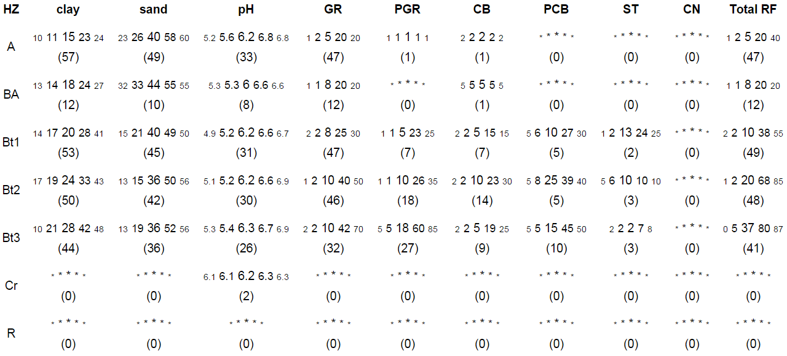

<!-- 
ideas:
http://landeco2point0.wordpress.com/2013/11/07/r-studio-and-presentations-and-git-oh-my/
http://rstudio-pubs-static.s3.amazonaws.com/27777_55697c3a476640caa0ad2099fe914ae5.html
https://r-forge.r-project.org/scm/viewvc.php/*checkout*/docs/aqp/gen-hz-assignment.html?root=aqp
-->


Soil Data Aggregation using R
========================================================
transition: none
width: 1024
height: 800
css: custom.css

<br><br><br><br><br><br><br><br><br>
<span style="color: white; font-size:75%;">This document is based on:</span>
<ul style="color: white; font-size:75%;">
<li>`aqp` version 1.8</li>
<li>`soilDB` version 1.5-2</li>
<li>`sharpshootR` version NA</li>
</ul>

What is R?
================
- an analysis platform: calculator, statistics program, GIS, etc...
- R syntax: vocabulary to explore, summarize, and model data


What is R?
================
- an integrator: analysis + GIS + database connectivity
- ODBC and GDAL link R to nearly all possible formats/interfaces


What can R do?
========================================================
- Base R (*functionality is extended through packages*)
  - basic summaries of quantitative or qualitative data
  - data exploration via graphics
  - GIS data processing and analysis

- Integrated Workflow (*self-documenting, repeatable*)
  - report writing: code + summaries in a single document
  - digital soil mapping: modeling properties and classes
  - evaluation of OSD, KSSL, NASIS, ... for SDJR or related

- Soil Science Specific Packages
  - visualization, aggregation, classification <span class="link-to-details">&#8594;&nbsp;[aqp package](http://aqp.r-forge.r-project.org/aqp-html-manual/index.html)</span>
  - access to commonly used soil databases <span class="link-to-details">&#8594;&nbsp;[soilDB package](http://aqp.r-forge.r-project.org/soilDB-html-manual/index.html)</span>
  - misc. soil survey specific functions <span class="link-to-details">&#8594;&nbsp;[sharpshootR package](http://aqp.r-forge.r-project.org/shapshootR-html-manual/index.html)</span>
 

What can R do?
========================================================

<br><br>

<br><br>
<center>**estimate a most-likely horizonation, details to follow**</center>

What can R do?
========================================================

<br><br>

<br><br>
<center>**estimate reasonable RIC, details to follow**</center>

Setup your local machine
========================================================

- Be sure to follow embedded links to full documentation
- Check out the [AQP project website](http://aqp.r-forge.r-project.org/)
- Browse some of the [various documentation](http://cran.r-project.org/manuals.html) on R

- The first time you open RStudio, **install** required packages:

```r
install.packages('aqp', dep=TRUE) 
install.packages("RODBC", dep=TRUE)
install.packages('soilDB', dep=TRUE)
```

- Every subsequent time, **load** required packages:

```r
library(aqp)
library(soilDB)
library(latticeExtra)
# ... other libraries you might be using
```


Connect to NASIS via ODBC
========================================================

- connection allows R to pull data from a NASIS *selected set* via the soilDB package
- connection sets up a small file that stores the NASIS login and password
- this is a one-time operation <span class="link-to-details">&#8594;&nbsp;[ODBC setup instructions](https://r-forge.r-project.org/scm/viewvc.php/*checkout*/docs/soilDB/setup_local_nasis.html?root=aqp)</span>

- getting data from NASIS is as simple as:

```r
# get pedons from the selected set
pedons <- fetchNASIS()

# plot the first 15
plot(pedons[1:15, ])

# get component data from the selected set
components <- get_component_data_from_NASIS_db()
```
- be sure to read the documentation <span class="link-to-details">&#8594;&nbsp;[`fetchNASIS()`](https://r-forge.r-project.org/scm/viewvc.php/*checkout*/docs/soilDB/soilDB-Intro.html?root=aqp)</span>


Aggregation of Pedon Data: Common Problems
========================================================


- description styles
 - the age-old splitters vs. lumpers
 - use of transitional horizons - I say tomato, you say tomato!
  
- legacy horizon nomenclature
 - old school meets new school and they ain't speakin' the same language.....

- soils described to varying depths - it's the pits!


Generalized Horizon Labels: Micro-correlation
========================================================


- generalized horizon labels = GHL
- determine the core concept 
- which way do transition horizons go?
 - GHL process allows for flexibility
- horizon redundancy - how many Bt horizons are necessary?
- outlier horizons - what happens to them?


Summary of GHL workflow
========================================================

<center>**Most of these steps are implemented in the reports presented last**</center>

1. Select a set of GHL that best represents a group of pedons to be aggregated.

2. Assign GHL to each horizon using whatever information is available for grouping horizons.

3. Evaluate GHL assignments and manually refine as needed.

4. Keep track of final GHL assignments in NASIS or text file.

5. Estimate a most likely horizonation e.g., top and bottom depths for each generalized horizon label.

6. Compute range in characteristics, aka low-rv-high values, for clay, sand, pH, etc. over GHL. (next document in this series)

[&#8594;&nbsp;extended tutorial](https://r-forge.r-project.org/scm/viewvc.php/*checkout*/docs/aqp/gen-hz-assignment.html?root=aqp)


Assumptions
========================================================
- a collection of pedons for a component should represent an aggregated component
- a GHL process of some kind is required to efficiently summarize and aggregate horizon data from these collections
- low-rv-high values must be tied to some metric: 
 - 5th-50th-95th percentile is one option
- linked pedons represent examples of the aggregate data, but aggregate data should not be limited to a very small set of linked pedons

- **IMPORTANT** these reports and data summaries are a useful *starting point* for the aggregation process


Summarizing Data with Quantiles (Percentiles)
========================================================

- suggested basis for RIC: 
  - 5th, 50th, and 95th percentiles are low-rv-high values
  - no assumptions of distribution, simple interpretation


```
Error in loadNamespace(name) : there is no package called 'Cairo'
```
