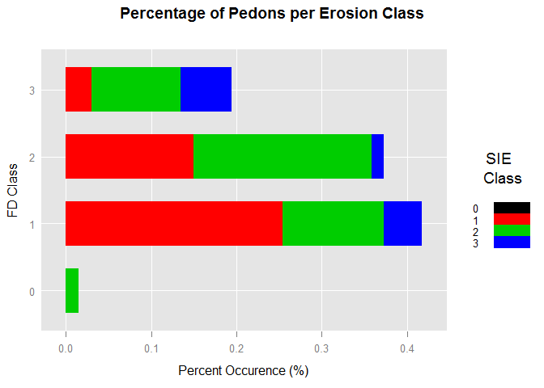
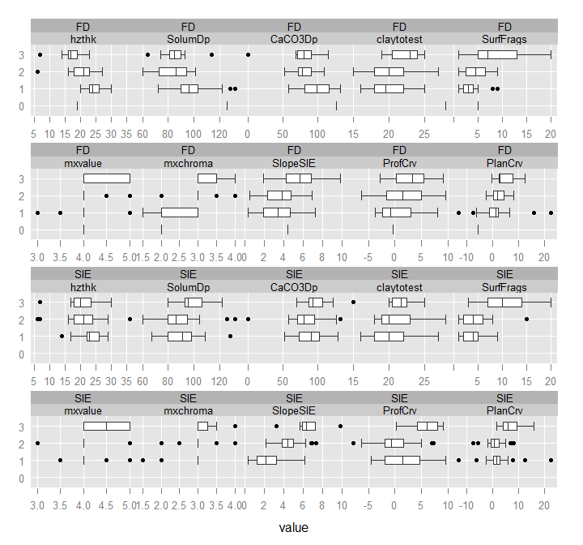
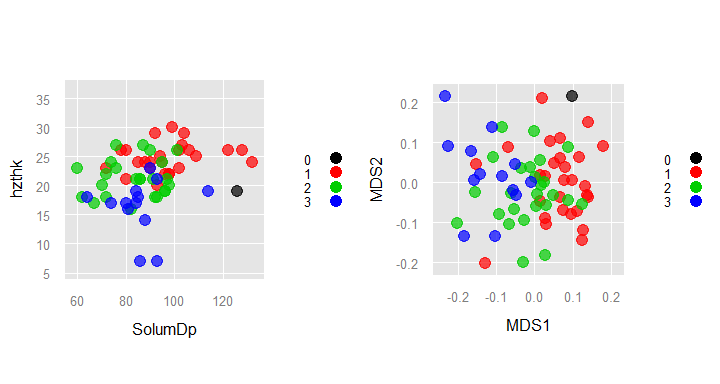
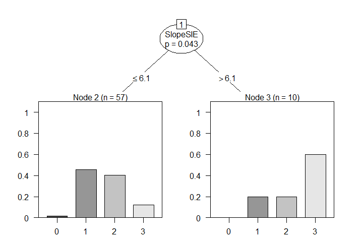
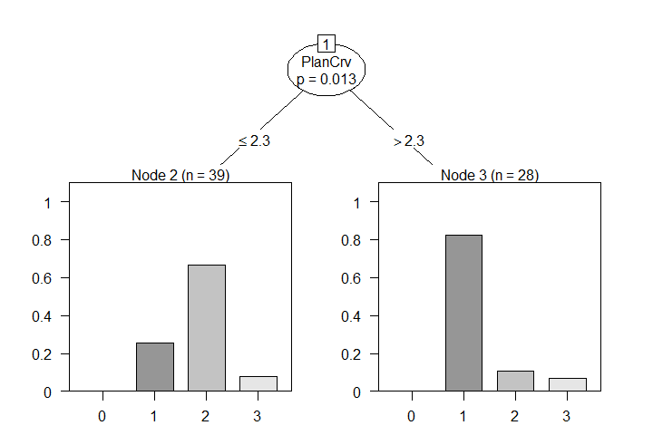

# Analysis of 11-FIN ArcSIE Erosion Classes
Stephen Roecker  
November 7, 2016  


## Introduction

This analysis looks at the field data collected for the following 2016 MLRA projects:
- MLRA 111E - Cardington and Centerburg silt loams, 2 to 6 percent slopes 
- MLRA 111E - Cardington and Centerburg silt loams, 2 to 6 percent slopes, eroded

One of the goals of these projects was to develop an ArcSIE model in order to differentiate erosion classes. The analysis below is intended to evaluate the field data and ArcSIE model.


## Import Data and Transform


```r
data <- read.csv("C:/workspace/neil_arcsie/Pedon_Data_DumpSIE.csv")

names(data) <- gsub(" ", "", names(data))
names(data) <- gsub("\\.", "", names(data))
data <- transform(data,
                  EroClassFD = as.factor(EroClassFD),
                  EroClassSIE = as.factor(EroClassSIE),
                  hzthk = hzdepb - hzdept,
                  rgb = munsell2rgb(mxhue, mxvalue, mxchroma, return_triplets = TRUE)
                  )

vals <- c("hzthk", "SolumDp", "CaCO3Dp", "claytotest", "SurfFrags", "mxvalue", "mxchroma", "SlopeSIE", "ProfCrv", "PlanCrv")
data_lo1 <- melt(data, id.vars = "EroClassFD", measure.vars = vals)
data_lo2 <- melt(data, id.vars = "EroClassSIE", measure.vars = vals)

names(data_lo1)[1] <- "EroClass"
data_lo1 <- transform(data_lo1, method = "FD")
names(data_lo2)[1] <- "EroClass"
data_lo2 <- transform(data_lo2, method = "SIE")
data_lo <- rbind(data_lo1, data_lo2)
```


## Evaluation of the Accuracy of the ArcSIE Predictions


```r
cm <- confusionMatrix(data = data$EroClassSIE, reference = data$EroClassFD)

cm$table
```

```
##           Reference
## Prediction  0  1  2  3
##          0  0  0  0  0
##          1  0 17 10  2
##          2  1  8 14  7
##          3  0  3  1  4
```

```r
round(cm$overall, 2)
```

```
##       Accuracy          Kappa  AccuracyLower  AccuracyUpper   AccuracyNull 
##           0.52           0.24           0.40           0.65           0.42 
## AccuracyPValue  McnemarPValue 
##           0.05            NaN
```

```r
round(cm$byClass, 2)
```

```
##          Sensitivity Specificity Pos Pred Value Neg Pred Value Precision
## Class: 0        0.00        1.00            NaN           0.99        NA
## Class: 1        0.61        0.69           0.59           0.71      0.59
## Class: 2        0.56        0.62           0.47           0.70      0.47
## Class: 3        0.31        0.93           0.50           0.85      0.50
##          Recall   F1 Prevalence Detection Rate Detection Prevalence
## Class: 0   0.00   NA       0.01           0.00                 0.00
## Class: 1   0.61 0.60       0.42           0.25                 0.43
## Class: 2   0.56 0.51       0.37           0.21                 0.45
## Class: 3   0.31 0.38       0.19           0.06                 0.12
##          Balanced Accuracy
## Class: 0              0.50
## Class: 1              0.65
## Class: 2              0.59
## Class: 3              0.62
```

```r
barchart(prop.table(t(cm$table)), 
         main = "Percentage of Pedons per Erosion Class", xlab = "Percent Occurence (%)", ylab = "FD Class",
         auto.key = list(space = "right", title = "SIE \n Class")
         )
```

<!-- -->

The overall accuracy of the ArcSIE predictions is 0.52. The confusion matrix above shows that the ArcSIE model was only able to able to discriminate EroClassFD class 1 and 2 approximately 0.62 of the time. The barchart shows this breakdown visually. Since the initial sampling, Tonie Endres has reviewed some of the observations that were misclassified in the field and determined the ArcSIE classes to be correct, thus the overall accuracy is somewhat higher.


### Boxplots of the Erosion Classes


```r
bwplot(EroClass ~ value | variable + method, data = data_lo, 
       scales = list(x ="free"), as.table = TRUE, layout = c(5, 4)
       )
```

<!-- -->

```r
# ggplot(data_lo, aes(x = EroClass, y = value)) +
#   geom_boxplot() +
#   facet_wrap(~ variable + method, scales="free_y")
```

The box plots show that the FD erosion classes have a linear trend for some variables, while other variables only show class 3 or 1 deviating from the other two classes. Overall the variation within each of the classes overlap considerably, such that in many cases the median values of one class falls within the interquartile range (e.g. 50%) of the other two classes. This overlap suggests that it is difficult/impractical to separate all the classes. Another interpretation is that a complex exist, however in this instance Tonie Endres has determined that adjacent classes would qualify as similar soils. In comparison, the trends between the SIE classes and variables appear to be less linear. The most important feature to highlight is that the trends between the SIE classes and digital elevation model (DEM) derivatives (i.e. slope) don't match those observed for the FD classes. This mismatch suggests that the membership functions for the SIE classes are a poor fit, and should be redefined to more accurately represent the relationship between the FD classes and DEM derivatives.


### Scatterplots of the Erosion Classes


```r
soil_vals <- c("hzthk", "SolumDp", "CaCO3Dp", "claytotest", "SurfFrags") # excluded color, only observed a narrow range thus small differences swamp everthing else
geo_vals <- c("SlopeSIE", "ProfCrv", "PlanCrv")
vals <- c(soil_vals, geo_vals)

test <- subset(data, select = vals)
test_d <- daisy(scale(test), metric = "gower")
test_mds <- metaMDS(test_d, distance = "gower", autotransform = FALSE)
```

```
## Run 0 stress 0.23203 
## Run 1 stress 0.2402671 
## Run 2 stress 0.2386669 
## Run 3 stress 0.2406629 
## Run 4 stress 0.2375132 
## Run 5 stress 0.236848 
## Run 6 stress 0.2339127 
## Run 7 stress 0.2407515 
## Run 8 stress 0.2434884 
## Run 9 stress 0.23392 
## Run 10 stress 0.2360614 
## Run 11 stress 0.2351266 
## Run 12 stress 0.237694 
## Run 13 stress 0.2425166 
## Run 14 stress 0.2357019 
## Run 15 stress 0.2409422 
## Run 16 stress 0.2322774 
## ... Procrustes: rmse 0.03233437  max resid 0.1474671 
## Run 17 stress 0.2377095 
## Run 18 stress 0.2411085 
## Run 19 stress 0.2377842 
## Run 20 stress 0.2339186 
## *** No convergence -- monoMDS stopping criteria:
##     20: stress ratio > sratmax
```

```r
test_pts <- cbind(as.data.frame(test_mds$points), EroClassFD = data$EroClassFD)

p1 <- xyplot(hzthk ~ SolumDp, groups = data$EroClassFD, data = data, 
             type = c("g", "p"), aspect = 1, alpha = 0.7,
             auto.key = list(space = "right")
             )
p2 <- xyplot(MDS2 ~ MDS1, groups = test_pts$EroClassFD, data = test_pts,
             type = c("g", "p"), aspect = 1, alpha = 0.7,
             auto.key = list(space = "right"),
             )
plot(p1, split = c(1, 1, 2, 1))
plot(p2, split = c(2, 1, 2, 1), newpage = FALSE)
```

<!-- -->


The scatter plots of the erosion classes displayed over various dimensions, including using multidimensional (MD) scaling, again show their is considerable overlap between the erosion classes. 


## Comparison of the Erosion Classes and Hierachical Clusters


```r
test_c <- hclust(test_d, method = "ward")
plot(test_c, labels = data$upedonid)
rect.hclust(test_c, k = 3)
```

<!-- -->

A hierarchical classification of the field data was generated in order to compare with the FD classes and determine if a more compact classification could be achieved. An threshold of 3 classes was selected. In examining the dendrogram it is apparent that one class is it much smaller than the other two.


```r
clusters <- cbind(data, test_pts, clusters = factor(cutree(test_c, k = 3), levels = 0:3))

with(clusters, table(EroClassFD, clusters))
```

```
##           clusters
## EroClassFD  0  1  2  3
##          0  0  0  0  1
##          1  0  7 18  3
##          2  0 15 10  0
##          3  0 11  1  1
```

```r
with(clusters, table(EroClassSIE, clusters))
```

```
##            clusters
## EroClassSIE  0  1  2  3
##           1  0 15 13  1
##           2  0 13 16  2
##           3  0  5  1  2
```

The contingency table shows that the FD class (EroClassFD) 1 overlaps the most with cluster 2, while FD class 2 overlap the most with the cluster 3. The ArcSIE predictions don't appear to have any correspondence with the hierarchical clusters.


### Scatter Plots of the Erosion Classes vs the Hierachical Clusters


```r
p1 <- xyplot(MDS2 ~ MDS1, groups = EroClassFD, data = clusters,
             type = c("g", "p"), aspect = 1, alpha = 0.7,
             auto.key = list(space = "right")
             )
p2 <- xyplot(MDS2 ~ MDS1, groups = clusters, data = clusters,
             type = c("g", "p"), aspect = 1, alpha = 0.7,
             auto.key = list(space = "right")
             )
plot(p1, split = c(1, 1, 2, 1))
plot(p2, split = c(2, 1, 2, 1), newpage = FALSE)
```

<!-- -->


In comparison the hierarchical clusters have considerably less overlap when viewed along the multidimensional scaled axes.


### Box Plots fo the Erosion Classes vs the Hierachical Clusters


```r
vals <- c("claytotest", "CaCO3Dp", "SurfFrags", "hzthk", "SolumDp", "PlanCrv", "ProfCrv", "SlopeSIE", "mxvalue", "mxchroma")

data_lo1 <- melt(data, id.vars = "EroClassFD", measure.vars = vals)
names(data_lo1)[1] <- "EroClass"
data_lo1 <- transform(data_lo1, method = "FD")

data_lo2 <- melt(clusters, id.vars = "clusters", measure.vars = vals)
names(data_lo2)[1] <- "EroClass"
data_lo2 <- transform(data_lo2, method = "clusters")

data_lo <- rbind(subset(data_lo1, as.character(variable) %in% vals), data_lo2)

bwplot(EroClass ~ value | variable + method, data = data_lo, 
       scales = list(x ="free"), as.table = TRUE, layout = c(5, 4)
       )
```

<!-- -->

```r
# ggplot(data_lo, aes(x = EroClass, y = value)) +
#   geom_boxplot() +
#   facet_wrap(~ variable + method, scales="free_y", ncol = 2)
```

In comparison the erosion classes and hierarchical clusters show a similarly degree of separability, but appear to be split on different variables. Amongst the clusters, the separation primarily appears to be based on the subsurface properties, such as solum and carbonates depth. In comparision the FD classes appear to be based most on the surface properties of the Ap horizon (hzthk, claytotest, SurfFrags). Because the clusters are differentiated based on subsurface soil properties, it suggests that they developed differently prior to human-induced erosion. It may be interesting to exclude the subsurface properties or downweight the subsurface properties and compute a new hierarchical classification.


### Classification Trees

In order to interpret the FD classes and clusters several classifications trees were constructed. Trees were constructed using both the soil properties and DEM derivatives separately, in order to determine what thresholds best defined the groups internally (e.g. how they might be best classified) and externally (e.g. how they might be mapped). It is worth mentioning that classification trees only look for the single best split amongst individual nodes, while an SIE model is typically a weighted average of several variables. 


#### FD Classes vs Soil Properties


```r
clusters <- subset(clusters, !is.na(EroClassFD))

test1 <- ctree(EroClassFD ~ ., data = clusters[, c("EroClassFD", soil_vals)])
plot(test1)
```

<!-- -->

```r
cm1 <- confusionMatrix(data = predict(test1, type = "response"), reference = clusters$EroClassFD)
cm1$table
```

```
##           Reference
## Prediction  0  1  2  3
##          0  0  0  0  0
##          1  0 26  9  1
##          2  1  2 16 12
##          3  0  0  0  0
```

```r
round(cm1$overall, 2)
```

```
##       Accuracy          Kappa  AccuracyLower  AccuracyUpper   AccuracyNull 
##           0.63           0.38           0.50           0.74           0.42 
## AccuracyPValue  McnemarPValue 
##           0.00            NaN
```

The classification tree of the FD classes using only the soil properties as predictors split the classes on horizon thickness (hzthk) using a break of 21-cm, and had an overall accuracy of 0.63. The breakdown the of individual nodes show that node 2 is more mixed than node 3. This result is similar to the SIE model which had difficulty separating class 2 and 3. The split at 21-cm approximately corresponds with the depth typically associated with tillage.


#### Clusters vs Soil Properties


```r
test2 <- ctree(clusters ~ ., data = clusters[, c("clusters", soil_vals)])
plot(test2)
```

<!-- -->

```r
cm2 <- confusionMatrix(data = predict(test2, type = "response"), reference = clusters$clusters)
cm2$table
```

```
##           Reference
## Prediction  0  1  2  3
##          0  0  0  0  0
##          1  0 29  3  0
##          2  0  4 24  0
##          3  0  0  2  5
```

```r
round(cm2$overall, 2)
```

```
##       Accuracy          Kappa  AccuracyLower  AccuracyUpper   AccuracyNull 
##           0.87           0.77           0.76           0.94           0.49 
## AccuracyPValue  McnemarPValue 
##           0.00            NaN
```

The classification tree for the hierarchical clusters using only soil properties as predictors, had several splits based on solum depth (SolumDp) and surface rock fragments (SurfFrags), and had an overall accuracy of 0.87.


#### FD Classes vs DEM Derivatives


```r
test3 <- ctree(EroClassFD ~ ., data = clusters[, c("EroClassFD", geo_vals)])
plot(test3)
```

<!-- -->

```r
cm3 <- confusionMatrix(data = predict(test3, type = "response"), reference = clusters$EroClassFD)
cm3$table
```

```
##           Reference
## Prediction  0  1  2  3
##          0  0  0  0  0
##          1  1 26 23  7
##          2  0  0  0  0
##          3  0  2  2  6
```

```r
cm3$overall
```

```
##       Accuracy          Kappa  AccuracyLower  AccuracyUpper   AccuracyNull 
##      0.4776119      0.1512848      0.3540149      0.6032516      0.4179104 
## AccuracyPValue  McnemarPValue 
##      0.1925839            NaN
```

The classification tree of the FD classes using only the DEM derivatives as predictors found the best split using a slope gradient of 6 percent, and had an overall accuracy of 0.48. This tree however was only able to map classes 1 and 3. The split at a slope of 6 percent matches the original slope break used within Morrow (OH117) and Knox (OH083) Counties to separate B1 (non-eroded, class 1) and B2 (eroded, class 2) slopes. Perhaps B2 slopes need to be updated to class 3.


#### Clusters vs DEM Derivatives


```r
test4 <- ctree(clusters ~ ., data = clusters[, c("clusters", geo_vals)])
plot(test4)
```

<!-- -->

```r
cm4 <- confusionMatrix(data = predict(test4, type = "response"), reference = clusters$clusters)
cm4$table
```

```
##           Reference
## Prediction  0  1  2  3
##          0  0  0  0  0
##          1  0 23  3  2
##          2  0 10 26  3
##          3  0  0  0  0
```

```r
round(cm4$overall, 2)
```

```
##       Accuracy          Kappa  AccuracyLower  AccuracyUpper   AccuracyNull 
##           0.73           0.50           0.61           0.83           0.49 
## AccuracyPValue  McnemarPValue 
##           0.00            NaN
```

The classification tree of the clusters using only the DEM derivatives as predictors found the best split using across slope (PlanCrv) curvature, and had an overall accuracy of 0.73. This resulted in a separation of classes 1 and 2, with class 2 occuring on convex positions (e.g. nose slopes). Given the narrow range in slope it seems logical that slope was not the dominant factor. 


## Summary

In summary the field determined (FD) erosion classes show a considerable amount of overlap in the soil properties evaluated. This overlap is likely reducing the accuracy of the ArcSIE, which is only ~ 50% overall. During the field assist the ambiguity of the erosion class definitions from the Soil Survey Manual and operator bias were discussed. Since the initial sampling, Tonie Endres has reviewed some of the observations that were misclassified in the field and determined the ArcSIE classes to be correct, thus the overall accuracy is maybe somewhat higher. Eitherway their appears to be confusion as to the proper field intrepretation of the erosion classes, their historic application, and whether the definition needs to be reassessed nationally. The most simplistic approach would be to compare the epipedon thickness to some undisturbed reference (which was likely to vary pre-european settlement). A classification tree of the existing FD classes showed that an Ap bottom depth of 21-cm would make the best split, which corresponds with the typically depth of tillage. When the FD classes were compared aganist hierarchical clusters it showed that a more compact classification could be achieved, but that the resulting clusters were predominately the result of the subsurface properties. In important point observed from an evalution of the SIE classes and DEM derivatives with box plots showed they didn't match the FD class landscape patterns. This mismatch indicates that the SIE membership functions should be adjusted, which may also increase the accuracy.

The only digital soil mapping (DSM) approach evaluated in this project was ArcSIE. In comparison with other DSM approaches, ArcSIE is referred to as knowledge-based, where the model or membership functions are manually defined, as opposed to a data-driven approach (i.e. statistical) where the model is derived from the data. The ArcSIE approach is particularly advantageous where their exist limited field data, but abundance of expert knowledge. Alternatively ArcSIE can be used to generate a working hypothesis, prior to sampling. Given that 68 pedon observations exist for this project their is potential to use a data-driven technique. In addition, data from adjacent areas, similiar soils, or other projects could also be used.

At this time the evaluation shows that several adjustments/iterations should be made to the ArcSIE Erosion Class model in quesiton. Below are several recommendations that should be investigated prior to finalizing the ArcSIE model. 

Recommendations:
- Adjust the SIE membership functions to reflect the landscape patterns in the FD classes and DEM derivatives
- Evaluate other applicable DSM models
- Evalute additional DEM derivatives, such as the topographic wetness index (TWI) and relative elevation, and perhaps other measures of curvature designed for low slopes, such as min or max curvature
- Streamline the process to be more production oriented, such as converting the raster product to vector, using a 5 or 10-meter DEM.

This was the first ArcSIE project that has been submitted for QA in Region 11. A large investment has been made in the research and development of ArcSIE and other digital soil mapping (DSM) techniques, therefore Neil Martin and Jennifer Callaway are to be commended for putting this technology to use. Region 11 encourages further use and refinement of ArcSIE and other DSM techniques.
