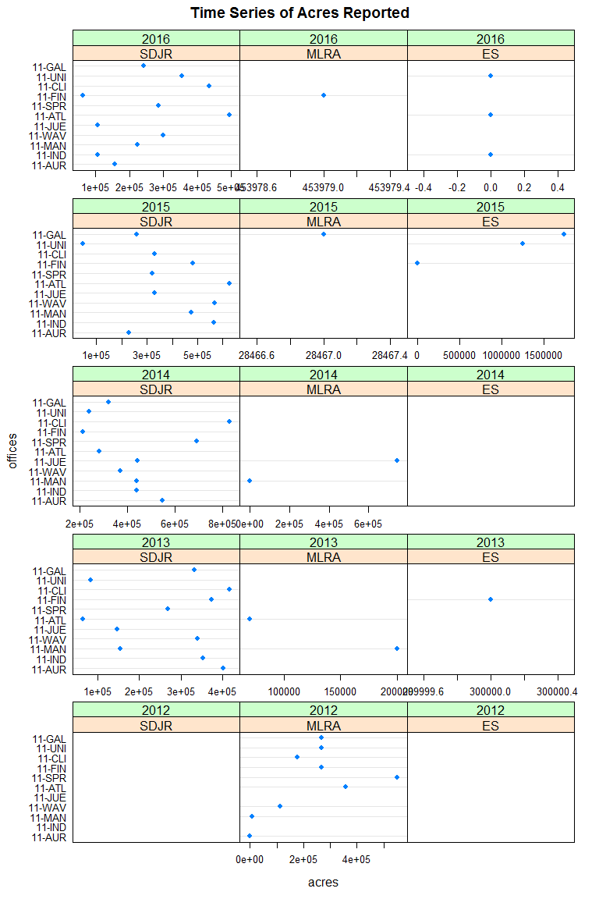
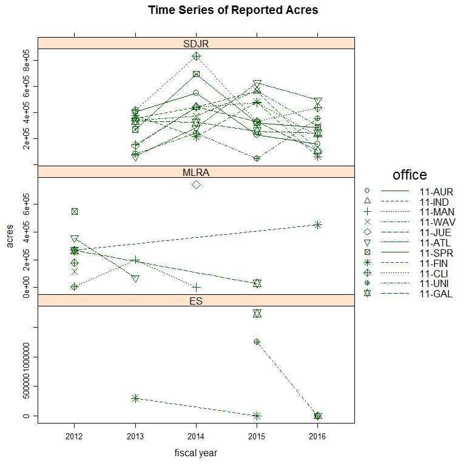
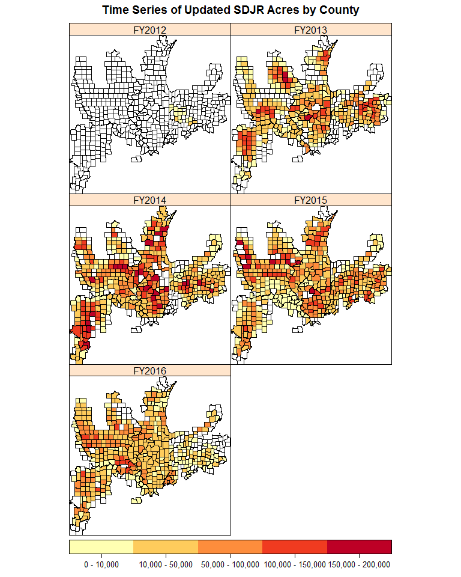

# SDJR and MLRA Summary
Stephen Roecker  
December 12, 2016  


```r
setwd("C:/Users/stephen.roecker/ownCloud/Documents/lims_data")

### Set parameters
ro <- 11
pt <- c("SDJR")
pt2 <- c("SDJR", "MLRA", "INITIAL", "ES")

# ## Fetch data from the server
# 
# data(state); st <- tolower(state.abb)
# # ssa <- read.dbf("M:/geodata/soils/soilsa_a_nrcs.dbf")
# # st <- sort(unique(substr(ssa$areasymbol, 1, 2)))
# asymbol <- paste0(st, "%25")
# project_id <- "%25"
# years <- 2012:2016; start_date <- paste0("10/01/", years - 1); finish_date <- paste0("10/01/", years)
# 
# goals <- lapply(years, function(x){
#   cat("fetching", x, "goals\n")
#   goals_report(x, "%25")
#   }); goals <- do.call("rbind", goals)
# 
# # rcors <- mapply(function(years, start_date, finish_date){
#   cat("fetching", years, "reverse correlation\n")
#   sdjr_correlation(asymbol, project_id, start_date, finish_date)
#   }, years, start_date, finish_date, SIMPLIFY = FALSE); rcors <- do.call("rbind", rcors)


## Load data from files

corr_dates <- "2015_09_24"
goal_dates <- "2016_12_13"
corr_files <- paste0("report_correlation_fy", 2012:2015, "_", corr_dates, ".csv")
goal_files <- paste0("report_goals_fy", substr(2012:2016, 3, 4), "_", goal_dates, ".csv")

rcors.. <- {lapply(corr_files, read.csv) ->.; do.call("rbind", .)}
rcors16 <- read.csv("report_correlation_fy2016_AK%25_WY%25_2016_09_19.csv")
goals <- {lapply(goal_files, read.csv) ->.; do.call("rbind", .)}
load(file = "ssa.Rdata"); ssa -> ssa2
ssa <- read.csv("M:/geodata/soils/SSA_Regional_Ownership_MASTER_MLRA_OFFICE.csv", stringsAsFactors = FALSE)
ssa_r11 <- ssa[ssa$Region == 11, "AREASYMBOL"]

## House Cleaning

### rcors
old_names <- c("sso", "old_musym", "old_natsym", "new_natsym", "old_mukey", "old_acres", "new_acres", "old_muname", "spatial", "old_musym2")
new_names <- c("office", "musym", "nationalmusym", "new_nationalmusym", "mukey", "muacres", "new_muacres", "muname", "spatial_change", "musym_orig")
names(rcors..)                              <- tolower(names(rcors..))
names(rcors..)[which(names(rcors..) %in% old_names)] <- new_names
rcors.. <- transform(rcors..,
                     projecttypename = substr(projectname, 1, 4),
                     state = substr(areasymbol, 1, 2)
                     )
rcors16 <- subset(rcors16, !is.na(new_mukey))
rcors16 <- transform(rcors16, 
                     state = substr(areasymbol, 1, 2)
                     )

match_names <- names(rcors..)[names(rcors..) %in% names(rcors16)]
rcors <- merge(rcors.., rcors16, all = TRUE)
rcors <- subset(rcors, select = match_names)


### goals
old_names <- c("ssoffice", "projecttype")
new_names <- c("office", "projecttypename")
names(goals)[which(names(goals) %in% old_names)] <- new_names

### save copy

save(rcors, file = paste0("rcors_fy_summary_", corr_dates, "_", format(Sys.time(), "%Y_%m_%d.Rdata")))
save(goals, file = paste0("goals_fy_summary_", corr_dates, "_", format(Sys.time(), "%Y_%m_%d.Rdata")))
```


## Examine Reported Acres


```r
temp <- filter(goals, region == ro) %>%
  group_by(fy, office, projecttypename) %>%
  summarize(
    goaled = sum(goaled),
    reported = sum(reported)
    )
temp <- subset(temp, projecttypename %in% pt2)
rank <- sort(tapply(temp$reported, list(temp$office), sum))
temp <- transform(temp,
                  office = factor(temp$office, levels = names(rank)),
                  fy = as.factor(fy),
                  projecttypename = factor(projecttypename, levels = sort(unique(temp$projecttypename), decreasing = TRUE))
                  )

dotplot(office ~ reported | projecttypename + fy, data = temp, 
        ylab = "offices", xlab = "acres", main = "Time Series of Acres Reported",
        scales = list(x = "free")
        )
```

<!-- -->


```r
n_office <- nlevels(temp$office)
n_ptype <- nlevels(temp$projecttypename)

xyplot(reported ~ fy | projecttypename, groups = office, data = temp,
       ylab = "acres", xlab = "fiscal year", main = "Time Series of Reported Acres",
       type = "o", pch = 1:n_office, lty = 1:n_office, lwd = 1.5, col = "darkgreen", cex = 1.2,
       layout = c(1, n_ptype), as.table = TRUE, scales = list(y = "free", alternating = 1),
       key = list(title = "office",
                  space = "right",
                  points = list(pch = 1:n_office, col = "darkgreen"),
                  lines = list(lty = 1:n_office, lwd = 1.5, col = "darkgreen"),
                  text = list(levels(temp$office))
                  )
       )
```

<!-- -->


## Compare Project Acres to Goal Acres


```r
rcors_acres <- group_by(rcors, fy, region, office, projectname, projectiid, areasymbol) %>%
  summarize(
    n = length(unique(musym_orig)), 
    old_acres = sum(unique(muacres)), 
    new_acres = sum(unique(new_muacres))
    ) %>%
  group_by(fy, region, office, projectname) %>% 
  summarize(
    n = sum(n),
    old_acres = sum(old_acres),
    new_acres = sum(new_acres)
    ) %>%
  as.data.frame()

temp <- merge(goals, rcors_acres, by = "projectname", all.x = TRUE)

progress <- group_by(temp, region.x, fy.x, projecttypename) %>% 
  summarize(reported = sum(reported) / 0.2,
            new_acres = sum(new_acres, na.rm = TRUE),
            dif_acres = sum(reported - new_acres, na.rm = TRUE),
            dif_pct = 100 - round(reported / new_acres * 100)
            ) %>%
  as.data.frame()

rank <- sort(tapply(progress$reported, list(progress$region.x), sum))
progress <- transform(progress,
                      region = factor(progress$region.x, levels = names(rank))
                      )
subset(progress, region == ro & projecttypename %in% pt)
```

```
##     region.x fy.x projecttypename reported new_acres dif_acres dif_pct
## 216       11 2013            SDJR 14683105  14518199    164906      -1
## 218       11 2014            SDJR 24150585  24332646   -182061       1
## 221       11 2015            SDJR 21141050  21182385    -41335       0
## 225       11 2016            SDJR 13828070  13786315     41755       0
##     region
## 216     11
## 218     11
## 221     11
## 225     11
```

```r
# dotplot(region ~ r_goaled | , data = progress, as.table = TRUE)
```


## Map Progress by AREASYMBOL


```r
rcors_as <- filter(rcors, region == ro & projecttypename %in% pt) %>%
  group_by(fy, region, projectiid, projecttypename, areasymbol) %>%
  summarize(
    n = length(unique(new_mukey)), 
    muacres = sum(unique(muacres)), 
    new_muacres = sum(unique(new_muacres))
  ) %>%
  group_by(fy, region, areasymbol) %>%
  summarize(
    muacres = sum(muacres),
    new_muacres = sum(new_muacres)
  ) %>%
  as.data.frame()

rcors_as$acres <- cut(rcors_as$new_muacres, breaks = c(0, 10000, 50000, 100000, 150000, 200000), labels = c("0 - 10,000", "10,000 - 50,000", "50,000 - 100,000", "100,000 - 150,000", "150,000 - 200,000"))

rcors_as_w <- reshape(rcors_as, idvar = "areasymbol", v.names = "acres", timevar = "fy", direction = "wide")
# rcors_as_w1 <- dcast(rcors_as, region + areasymbol ~ fy, value.var = "new_muacres", sum) # inserts 0 instead of NA
# rcors_as_w2 <- spread(rcors_as, fy, muacres) # this doesn't aggregate, would need to be followed

fy <- paste0("acres.", sort(unique(rcors_as$fy)))
FY <- paste0("FY", sort(unique(rcors_as$fy)))
names(rcors_as_w)[which(names(rcors_as_w) %in% fy)] <- FY

ssa2$state <- substr(ssa2$areasymbol, 1, 2)
st <- toupper(c("ia", "il", "in", "ks", "ky", "mi", "mn", "mo", "ne", "oh", "ok", "sd", "wi"))

ssa3 <- merge(ssa2, rcors_as_w, by = "areasymbol", all.x = TRUE)
temp_sub1 <- subset(ssa3, region == ro, select = FY)
#temp_sub2 <- subset(ssa3, state %in% st, select = FY)
bb <- bbox(temp_sub1)

spplot(temp_sub1,
       main = paste0("Time Series of Updated ", paste0(pt, collapse = " & "), " Acres by County"),
       #xlim = bb[1, ], ylim = bb[2, ],
       as.table = TRUE,
       col.regions = brewer.pal(5, "YlOrRd"),
       colorkey = list(space = "bottom", height = 1)
       )
```

<!-- -->


## Summarize and plot acres by musym


